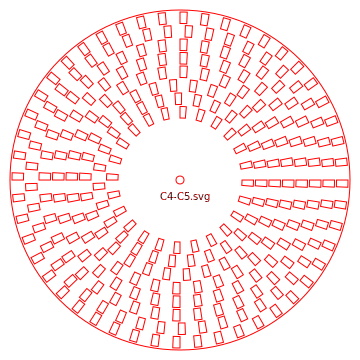

# ElectricFanHarpTool
## 概要
扇風琴(Electric Fan Harp)の羽根製作用のツール
* ElectricFanHarpBladeSVG 
羽根データをSVGフォーマットで生成

* ElectricFanHarpBladeDXF 
羽根データをDXFフォーマットで生成

* ElectricFanHarpSim 
羽根データに基づいて音データをwavフォーマットで生成

## 羽根データ
* 内円直径 
  
* 外円直径 

* 環状扇形 (内半径, 外半径, 1周分割数, 穴比率) 
以上をCSV形式で指示  

## 使い方
1. 各ツールのPythonプログラムを実行 
1. CSVファイルを指定 
1. 各ツールのファイルが (CSVファイル名＋各ツールの拡張子) で生成される

## 羽根データ例

